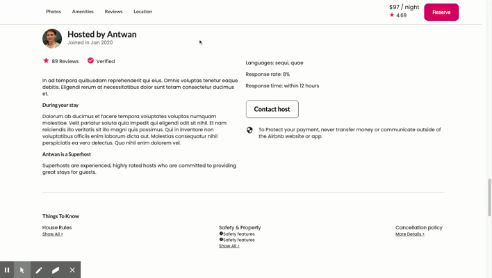

# Host Microservice

A microservice for Airbnb Item Detail Page clone, Airbrb. It is created with Node.js, React and MongoDB



  >Airbnb users will be able to read more about the host and see if the host is a superhost and verified.

## Related Projects

  - Trello Board: https://trello.com/b/dR6Qp3HX/fec-airbrb
  - Github: https://github.com/Wilberg-Airbnb
  - **https://github.com/Wilberg-Airbnb/location** (microservice I developed)
  - https://github.com/Wilberg-Airbnb/reservation
  - https://github.com/Wilberg-Airbnb/reviews
  - https://github.com/Wilberg-Airbnb/suggestion
  - https://github.com/Wilberg-Airbnb/photos
  - https://github.com/Wilberg-Airbnb/description


## Table of Contents

1. [Usage](#Usage)
2. [Requirements](#Requirements)
3. [Installation and Setup](#Installation and Setup)
4. [Deployment](#Deployment)

## Usage

  - GET URL: http://3.12.169.208:2001/api/location/:listingId
  - GET Endpoint: /api/location/:listingId (GET: /api/location/0)

    Sample Output:
    ```json
        {
            "listingId": [
                0,
                92,
                27
            ],
            "languages": [],
            "_id": "5eefdd4f50523cd61aaccc77",
            "hostId": 18,
            "fullName": "Mable Zemlak Jr.",
            "joined": "Mon Jan 13 2020 01:31:21 GMT-0800 (Pacific Standard Time)",
            "photoUrl": "http://lorempixel.com/640/480/people",
            "superhost": "true",
            "verification": "Verified",
            "description": "Earum minus sapiente corporis. Ratione delectus nihil inventore non iusto distinctio natus. Inventore adipisci ut at atque ex atque est et adipisci. Est nobis sit amet optio et ut in debitis.",
            "duringYourStay": null,
            "responseRate": 26,
            "responseTime": "within an hour",
            "__v": 0
        }
    ```

## Requirements

- Node 6.13.0
- React 16.13.1
- Express 4.17
- Mongoose 5.9.19
- MongoDB 4.2.6
- Bluebird 3.7.2
- Faker 4.1.0
- Semanitic UI React
- Material UI

## Installation and Setup
  
From within the root directory:

```sh
 $ npm install
 $ npm run seed 
 $ npm run server-dev
```

Service renders at:
    <div id="host"></div>

- if proxy server URL is: domain/:listingId/ then Bundle.js url: http://localhost:2000/public/bundle.js
- if proxy server URL is: domain?id=:listingId then Bundle.js url: http://localhost:2000/bundle.js

## Deployment

Create a Docker image and spin a container by running docker-compose.yml

```sh
docker-compose up
```
